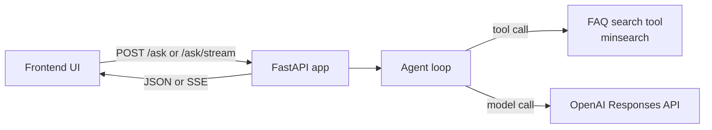

# End-to-End Agent Deployment

This directory contains the workshop code for the AI Shipping Labs session "End-to-End Agent Deployment" on April 28, 2026.

## Overview



## Prerequisites

- Python 3.13+
- OpenAI API key
- Docker if you want to build the container image

## What's In This Code

- `app.py`: application entry point. On startup it initializes the FAQ search index and creates a shared `AsyncOpenAI` client. It exposes:
  - `GET /health` for a basic health check
  - `POST /ask` for a non-streaming JSON response
  - `POST /ask/stream` for a streaming SSE response
- `agent.py`: core agent loop. It sends the user question plus system instructions to the OpenAI Responses API, streams text deltas back through a renderer, inspects the model output for function calls, executes the `search` tool when requested, appends tool results back into message history, and repeats for up to 5 iterations.
- `search.py`: FAQ retrieval layer. It downloads the Data Engineering Zoomcamp FAQ JSON, builds an in-memory `minsearch` index over `question`, `answer`, and `section`, and exposes both the Python `search()` function and the tool schema shown to the model.
- `renderer.py`: output adapters. `CollectingRenderer` accumulates streamed tokens plus tool call metadata so `/ask` can return one final JSON object; `SSEQueueRenderer` converts events into Server-Sent Events so `/ask/stream` can update the UI live.
- `schemas.py`: Pydantic API models. `AskRequest` validates the incoming question, while `AskResponse` and `ToolCall` define the structured response shape for the non-streaming endpoint.
- `frontend/`: frontend source code. `main.js` posts a question to `/ask/stream`, parses incoming SSE chunks manually, renders assistant tokens as they arrive, and shows tool calls and tool results in expandable blocks. `index.html` provides the shell, and `style.css` defines the simple chat-style layout.
- `notebook.ipynb`: notebook version of the workshop code for exploring the same agent flow interactively.
- `Dockerfile`: production-style build. It first builds the frontend with Vite, then copies the generated frontend bundle into `./static` in the Python image, installs backend dependencies with `uv`, and starts `uvicorn`.
- `Makefile`: convenience commands for local backend runs, frontend dev mode, and Docker build/run.

## Request Flow

1. The frontend sends the user's question to `/ask/stream` or `/ask`.
2. FastAPI passes the question to `run_agent(...)`.
3. The agent asks the model for an answer and gives it one tool: `search(query)`.
4. If the model calls the tool, the backend searches the FAQ index and appends the results back into the conversation.
5. The loop continues until the model returns a final answer without another tool call.
6. The result is returned either as:
   - one JSON payload from `/ask`
   - a stream of SSE events from `/ask/stream`

## Frontend And Static Assets

- In development, the frontend source lives in `frontend/` and can be run with Vite.
- In the container build, Vite outputs compiled assets into `dist/`, and the Dockerfile copies that bundle into `static/`.
- `app.py` serves the frontend only when the `static/` directory exists, which is the production/container path.

## Running Locally

```bash
uv sync --locked
export OPENAI_API_KEY=sk-...
uv run fastapi dev app.py
```

## CI/CD

- The source project includes `.github/workflows/deploy.yml`.
- That workflow deploys to Railway, not Fly.
- In this repository the code lives under a workshop subfolder, so the copied workflow is part of the snapshot, not an active repo-level workflow.
